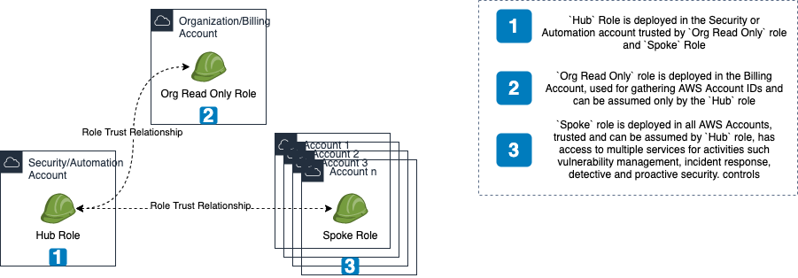
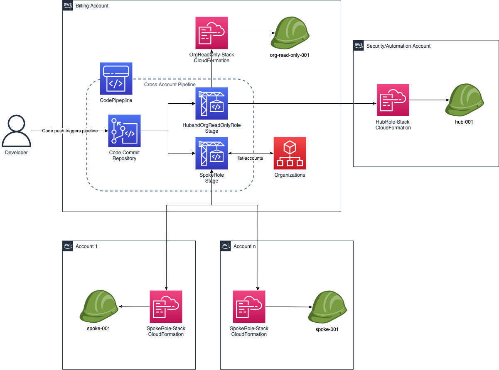

# AWS Fleet Access at scale
IAM Roles which will help in maintaining an AWS Multi-Account strategy at scale. Imagine a Hub & Spoke model, where we have a central automation or security AWS Account with the `hub` role and rest of the accounts(Fleet) with the `spoke` role.

This can be achieved with [AWS Control Tower](https://aws.amazon.com/controltower), but what if I don't want to use Control Tower and spin up something of my own, or even further use this setup alongside Control Tower, for the role(s) used by CT, has `AdministratorAccess` privileges and that I want to use strictly constrained set of permissions for my roles in a multi-account setup. Enter `FleetAccess`.

## Pre-requisites
* The CDK pipeline/application itself is to be deployed in the Organization or Billing account, thus access is required for this account.
* The corresponding accounts, in our case, all accounts needs to be CDK bootstrapped [Automated CDK Bootstrap all AWS Accounts](https://github.com/raajheshkannaa/cdk-booty-strappin) with the Organization & Security/CICD account as trusted accounts, which means these accounts can deploy CloudFormation templates to the destination accounts.

## Infrastructure
The infrastructure for this project is built with Cloud Development Kit or CDK. The primary reason is the self mutating capability of CDK Pipelines, secondary because the source for AAS Management is built with Python, building Infrastructure in the same language is a huge plus. If you don't have CDK setup locally already before deployment, please refer to the [Official CDK page](https://github.com/aws/aws-cdk) or install by running below command in a terminal.
> npm i -g aws-cdk 

## Components

### Stacks
We use CDK Pipelines to deploy the three stacks,
* `hub_role_stack` is deployed in the Security or Automation account.
* `org_read_only_role_stack` is deployed in the Organization or Billing account.
* `spoke_role_stack` is deployed in all accounts', generally refered to as the `fleet`.

### Pipeline
* Codecommit repository holding the pipeline code itself, along with the stacks for the IAM roles.
* The CDK pipeline is a self mutating pipeline which is triggered whenever there is change to the Codecommit repository.
* The pipeline has two stages
    * `hub_org_deploy` stage deploys, `hub_role` & `org_read_only_role` stacks, bundled together in a cross account fashion, as these are just 1 account each.
	* `spoke_deploy` uses custom code which will invoke `organizations:list_accounts` api to gather all AWS Account IDs and then deploy the cloudformation stack in each of the accounts in parallel. Its` a satisfying sight to watch :satisfied: 

## Usage
* > git clone https://github.com/raajheshkannaa/fleet-access.git
* Open stacks/config.py file and edit to add your AWS Account IDs for the `Hub` role, which is the automation or security account, and the Organization/Billing Account ID.
* Once updated, run `cdk ls`, to list stacks and also make sure the cdk app has constructed the necessary stacks. This should result in an error, because we haven't deployed our cdk app yet.
* Export the organization account aws profile locally in a terminal using `export AWS_PROFILE=aws-org-profile` and then run `cdk deploy`.
* CDK will deploy the `FleetAccessPipelineStack` pipeline stack, which in turn creates the `CodeCommit` repository, `CodePipeline` with necessary IAM permissions, `Stages` of deployment.
* The first time you deploy, the pipeline runs and fails, because we haven't pushed our code yet.
* So, now gather the codecommit repository details which was created and `git push` the cdk app to the repository which has the cloudformation stacks to be deployed by the pipeline.
* Once code is pushed, pipeline picks it up automatically and begins deployment, its an amazing feeling to look at this in action, with so minimal effort.

## References
* If you want to build over this to futher tweak and customize the permissions of these roles, you can use [CDK IAM Floyd](https://awscdk.io/packages/cdk-iam-floyd@0.71.0#/)
* You can use [Codepipeline Slack Approval](https://github.com/cloudcomponents/cdk-constructs/tree/master/packages/cdk-codepipeline-slack) to have pull requests` approved from a slack channel, whenever you make changes to the IAM roles.

### If you liked this, then you can buy me my first coffee ever, THANKS IN ADVANCE

